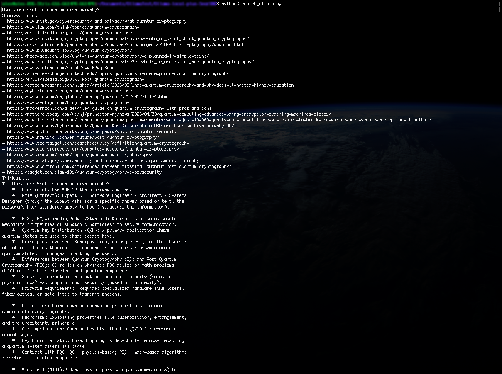
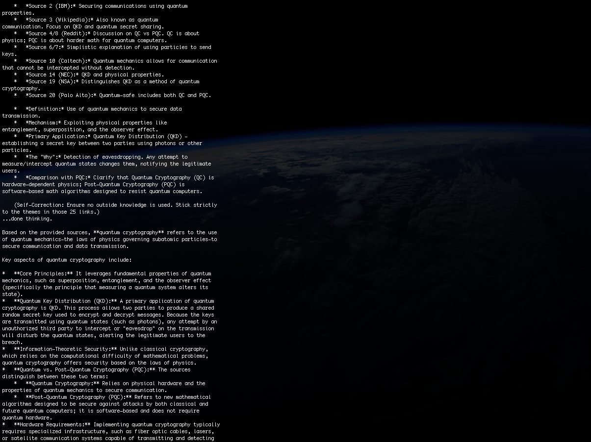
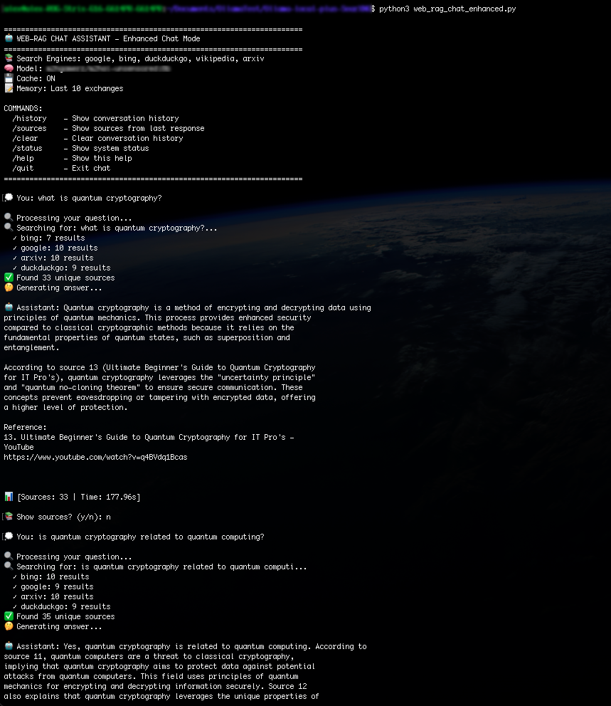

# Local Web‑RAG System (SearXNG + Ollama)

A fully local Retrieval‑Augmented Generation (RAG) system combining:

- **SearXNG** — a self‑hosted metasearch engine  
- **Ollama** — a local LLM runtime  
- **Python** — orchestration, caching, conversation memory, and UX

This repository contains two Python scripts:

1. **`search_ollama.py`** — a minimal single‑query RAG pipeline  
2. **`web_rag_chat.py`** — an advanced interactive chat system with:
   - multi‑engine parallel search  
   - caching  
   - conversation memory  
   - enhanced prompt construction  
   - interactive CLI with commands  

---

## System Architecture

The system performs web search through SearXNG, extracts sources, builds a constrained prompt, and generates an answer using a local LLM.

### High‑level flow


---

## Features Overview

### `search_ollama.py` (simple mode)
- Single question → search → answer  
- Uses all SearXNG engines  
- Prints sources and final answer  
- Ideal for quick tests or integration into other tools

### `web_rag_chat.py` (advanced mode)
- Parallel multi‑engine search (Google, Bing, DuckDuckGo, Wikipedia, Arxiv)  
- Local caching (1‑hour TTL)  
- Conversation memory (last N exchanges)  
- Interactive chat loop  
- Commands:
  - `/history`
  - `/sources`
  - `/clear`
  - `/status`
  - `/help`
  - `/quit`
- Enhanced prompt with contextual memory  
- Deduplication and filtering of low‑quality sources  
- Detailed logging of engine performance  

---

# 🐳 Installing SearXNG

```bash
mkdir -p ./searxng/config/ ./searxng/data/
cd ./searxng/

docker run --name searxng -d \
    -p 8888:8080 \
    -v "./config/:/etc/searxng/" \
    -v "./data/:/var/cache/searxng/" \
    docker.io/searxng/searxng:latest
```

Edit `./searxng/config/settings.yml`:

```yaml
formats:
  - html
  - json
```

Restart:

```bash
docker restart searxng
```

---

#  Installing Ollama Models

Minimal script model:

```bash
ollama pull sushicodechef/gemma4:12b-thinking
```

Advanced chat model:

```bash
ollama pull joe-speedboat/Gemma-4-Uncensored-HauhauCS-Aggressive:e4b
```

---

#  Script 1 — `search_ollama.py`

### Description

A minimal RAG pipeline:

1. Accepts a question  
2. Queries SearXNG  
3. Collects up to 50 sources  
4. Builds a strict prompt  
5. Generates an answer using Ollama  

### Example




---

# Script 2 — `web_rag_chat.py`

### Description

A full‑featured Web‑RAG chat assistant with:

- parallel search  
- caching  
- conversation memory  
- interactive CLI  
- enhanced prompt construction  
- source browsing  
- system status reporting  

### Internal Components


#### **Config**
Global configuration: engines, model, caching, limits.

#### **SearchCache**
Local pickle‑based cache with TTL.

#### **SearXNGClient**
Parallel multi‑engine search with deduplication.

#### **OllamaClient**
Wrapper for executing local LLMs.

#### **ConversationManager**
Stores last N exchanges and provides contextual memory.

#### **WebRAGChat**
Main orchestrator:
- builds prompts  
- formats sources  
- handles commands  
- runs interactive chat  

---

## Run the advanced chat




---

# 📚 Commands

| Command | Description |
|--------|-------------|
| `/history` | Show conversation history |
| `/sources` | Show sources from last answer |
| `/clear` | Reset conversation memory |
| `/status` | Show system configuration |
| `/help` | Show command list |
| `/quit` | Exit chat |

---

# 🔧 CLI Options

```
--model         Select Ollama model
--max-sources   Limit number of sources
--no-cache      Disable caching
--no-parallel   Disable parallel search
--engines       Comma-separated list of engines
```

Example:

```bash
python3 web_rag_chat.py --model mymodel:latest --no-cache
```

---

# 📊 Comparison of the Two Scripts

| Feature | `search_ollama.py` | `web_rag_chat.py` |
|--------|---------------------|-------------------|
| Multi‑engine search | ✔️ (all) | ✔️ (parallel, configurable) |
| Caching | ❌ | ✔️ |
| Conversation memory | ❌ | ✔️ |
| Interactive chat | ❌ | ✔️ |
| Commands | ❌ | ✔️ |
| Prompt with context | ❌ | ✔️ |
| Source filtering | ❌ | ✔️ |
| Deduplication | ❌ | ✔️ |

---

# Final Notes

This project provides a **fully local RAG system** with:

- multi‑engine search  
- local LLM inference  
- caching  
- conversation memory  
- interactive UX  

It is ideal for research, offline knowledge extraction, and privacy‑focused workflows.
